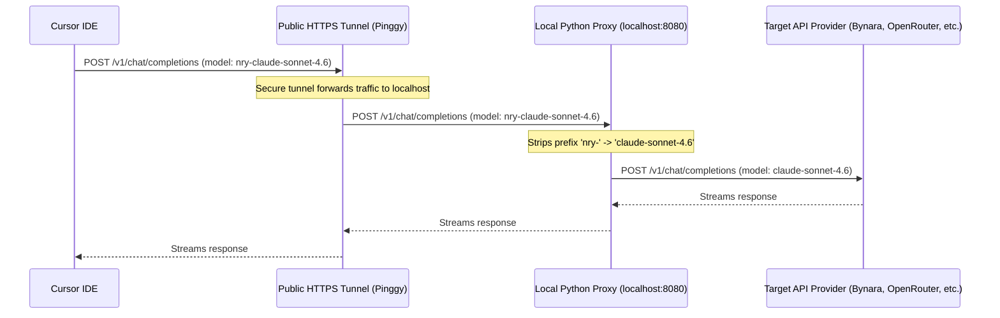

# Cursor Private Network & Model Name Bypass Proxy

A zero-dependency Python proxy utility that resolves two of the most common issues when using custom OpenAI-compatible endpoints inside the Cursor IDE:

1. **"Access to private networks is forbidden"**: Cursor blocks `localhost` / `127.0.0.1` for custom API endpoints to prevent SSRF security risks. This script automatically spins up a secure public HTTPS tunnel (powered by [Pinggy](https://pinggy.io/)) directly in the background using the built-in Windows/macOS/Linux SSH client.
2. **"Model name is not valid: claude-..."**: Cursor intercepts model names starting with `claude-` or `gpt-` and routes them to native Anthropic/OpenAI integrations, breaking custom routers (like OpenRouter, Naraya, DeepSeek, etc.). This proxy prefixes models with a custom identifier (e.g. `nry-` or `custom-`) so Cursor lets them pass, and translates them back to their original names before forwarding them to the provider.

---

## How It Works



---

## Features

- 🔌 **Zero Dependencies**: Pure Python code using only standard library modules (`http.server`, `urllib`, `subprocess`, `threading`). No `pip install` required! Includes a small built-in `ui.py` helper for a polished ANSI CLI (banner, panels, spinner) — still stdlib only.
- 🚇 **Auto-Tunneling**: Spawns an SSH tunnel automatically without needing `ngrok` accounts, tokens, or custom executables.
- 🔄 **On-the-Fly Translation**: Automatically strips prefixes (e.g., `nry-`) from incoming requests.
- 🔍 **Dynamic Model Discovery**: Maps the `/models` endpoint to list your provider's models with the custom prefix auto-applied.

---

## Configuration

1. Clone or download this repository.
2. Copy `config.json.example` to `config.json`:
   ```bash
   cp config.json.example config.json
   ```
3. Edit `config.json` with your settings:
   ```json
   {
     "port": 8080,
     "target_base_url": "https://router.bynara.id/v1",
     "api_key": "YOUR_API_KEY_HERE",
     "model_prefix": "nry-"
   }
   ```

---

## Running the Proxy

- **Windows**: Double-click `run.bat` or run:
  ```powershell
  .\run.bat
  ```
- **macOS / Linux**: Mark the script executable and run:
  ```bash
  chmod +x run.sh
  ./run.sh
  ```

Once running, the script will output a public HTTPS URL in the console:

```text
======================================================================
💥 CURSOR PROXY ATTIVO ED ESPOSTO! 💥
👉 Configura Cursor inserendo questo URL (Override OpenAI Base URL):
   https://piproxy-xxxx.pinggy.link/v1
======================================================================
```

---

## Configuring Cursor

1. Open **Cursor Settings** -> **Models**.
2. Under **OpenAI API**:
   - Turn **ON** the switch.
   - Enter a dummy API Key (e.g., `dummy` or `sk-dummy`).
   - Click **Override OpenAI Base URL** and paste the public HTTPS URL printed by the proxy (make sure to include `/v1` at the end).
3. Under **Models**:
   - Click **+ Add model** and type the name of the model prefixed by your prefix (e.g. `nry-claude-sonnet-4.6`, `nry-gemini-3-flash`).
4. You are ready to chat! The console will log connection activity as you prompt Cursor.

---

## License

This project is open-source and available under the [MIT License](LICENSE).
