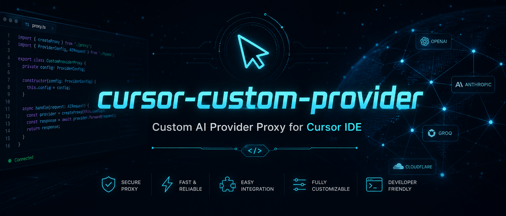
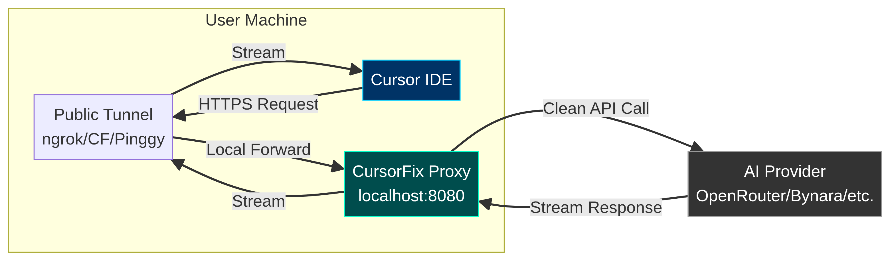

# Cursor Custom Provider 
**Proxy for Custom AI Providers in Cursor IDE**




A lightweight, self-contained proxy that allows **Cursor IDE** users to integrate OpenAI-compatible AI providers and custom models, bypassing native IDE restrictions.

> **Please Note:** This tool does NOT provide free models. You must bring your own provider account and a valid API key. The proxy simply routes Cursor's requests to your chosen endpoint, bypassing Cursor's built-in model restrictions.

---

## What problem does this solve?

Cursor IDE has two main limitations when you want to use a custom provider (such as OpenRouter, Bynara, DeepSeek, etc.):

1.  **"Access to private networks is forbidden"** — Cursor blocks `localhost` / `127.0.0.1` as custom API endpoints. cursor-custom-provider spins up a public HTTPS tunnel so Cursor can reach the proxy.
2.  **"Model name is not valid"** — Cursor intercepts model names starting with `claude-` or `gpt-` and routes them to its native integrations. This proxy prefixes model names (e.g., `custom-claude-sonnet-4.6`) and translates them back before forwarding them to your provider.

---

## Features

-   🔌 **Zero external Python dependencies** — Uses only the standard library (`http.server`, `urllib`, `subprocess`).
-   🌐 **Stable public URL** — ngrok static domain support, so you configure Cursor once and never touch it again.
-   🔄 **Model-name translation** — Adds a custom prefix (e.g., `nry-`) to bypass Cursor's model validation.
-   🔒 **Proxy authentication** — A `proxy_secret` prevents anyone with the public URL from burning your API credits.
-   🛡️ **Per-IP rate limiting** — A token-bucket rate limit to blunt abuse if the URL leaks.
-   🎨 **Polished CLI** — ANSI banner, bordered panels, spinner, and colored request logs for a better user experience.

---

## How it works

The following diagram illustrates the request flow through cursor-custom-provider:



---

## Requirements

-   **Cursor Pro plan or higher** is required to use custom API keys / BYOK (Bring Your Own Key). The free tier does not expose the "Override OpenAI Base URL" option.
-   A **provider account** with an OpenAI-compatible endpoint and a valid API key.
-   Python 3.8 or newer.
-   An [ngrok](https://ngrok.com) account (free tier is enough) for a stable public URL, or fallback to Cloudflare / Pinggy.

---

## Quick Start

1.  **Clone the repository**

    ```bash
    git clone https://github.com/xFurti/cursor-custom-provider.git
    cd cursor-custom-provider
    ```

2.  **Copy the example config**

    ```bash
    cp config.json.example config.json
    ```

3.  **Edit `config.json`**

    ```json
    {
      "port": 8080,
      "target_base_url": "YOUR_PROVIDER_URL_BASE",
      "api_key": "YOUR_PROVIDER_API_KEY",
      "model_prefix": "custom-",
      "tunnel_provider": "ngrok",
      "ngrok_authtoken": "YOUR_NGROK_AUTHTOKEN",
      "ngrok_domain": "your-name.ngrok-free.app",
      "proxy_secret": "GENERATE_A_SECRET_RANDOM_HERE",
      "rate_limit_per_min": 30 //it  depends on your provider
    }
    ```

    | Key | Description |
    |---|---|
    | `port` | Local port the proxy listens on. |
    | `target_base_url` | Your provider's OpenAI-compatible base URL. |
    | `api_key` | Your provider's API key. |
    | `model_prefix` | Prefix added to model names in Cursor. |
    | `tunnel_provider` | `ngrok`, `cloudflare`, or `pinggy`. |
    | `ngrok_authtoken` | Your ngrok authtoken. |
    | `ngrok_domain` | A static domain claimed in your ngrok dashboard. |
    | `proxy_secret` | The secret Cursor must send as its "API Key". |
    | `rate_limit_per_min` | Max requests per minute per IP (`0` = unlimited). |

4.  **Run the proxy**

    -   **Windows**: double-click `scripts/run.bat` or run `python src/cursor_proxy.py`
    -   **macOS / Linux**: `./scripts/run.sh` or `python src/cursor_proxy.py`

5.  **Configure Cursor**

    1.  Open **Cursor Settings → Models**.
    2.  Enable **OpenAI API**.
    3.  In **API Key**, paste your `proxy_secret`.
    4.  Click **Override OpenAI Base URL** and paste the URL shown in the terminal (e.g., `https://your-name.ngrok-free.app/v1`).
    5.  Under **Models**, click **+ Add model** and type the model name with your prefix, e.g., `custom-claude-sonnet-4.6`.

---

## Tunnel Providers

### ngrok (recommended)

1.  Create a free account at [ngrok.com](https://ngrok.com).
2.  Copy your **authtoken** from the dashboard.
3.  Go to **Domains** and claim a free static domain (e.g., `your-name.ngrok-free.app`).
4.  Fill both values into `config.json`.

### Cloudflare (fallback)

Set `tunnel_provider` to `cloudflare`. The tool will download `cloudflared.exe` automatically on Windows. The URL changes on every restart, so you must update Cursor each time.

### Pinggy (fallback)

Set `tunnel_provider` to `pinggy`. Uses SSH reverse tunneling. Free sessions last 60 minutes.

---

## Security

-   **Always set `proxy_secret`**. The public tunnel URL can be guessed or leaked; the secret ensures only Cursor can send requests through your proxy.
-   The proxy validates the `Authorization: Bearer <proxy_secret>` header on every request.
-   `config.json` is gitignored by default — never commit it.
-   Client-facing errors are generic; full details are written only to `proxy_log.txt`.

---

## ⚠️ Disclaimer

-   This tool is provided **as-is** for educational and personal use.
-   Bypassing Cursor's model routing may violate Cursor's Terms of Service. Use at your own risk.
-   The authors are not responsible for any account restrictions, API charges, or other issues arising from the use of this tool.

---

## License

This project is licensed under the [MIT License](LICENSE).
